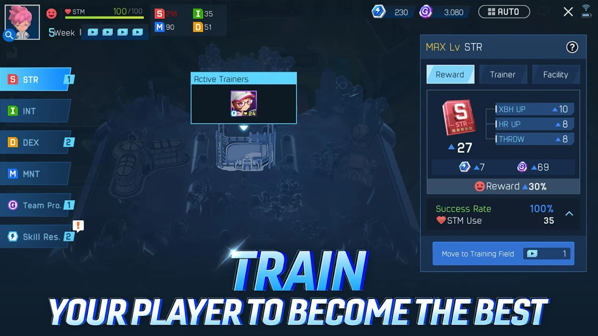
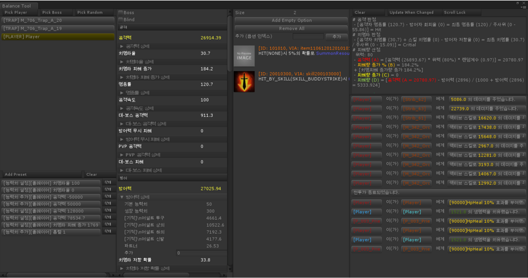
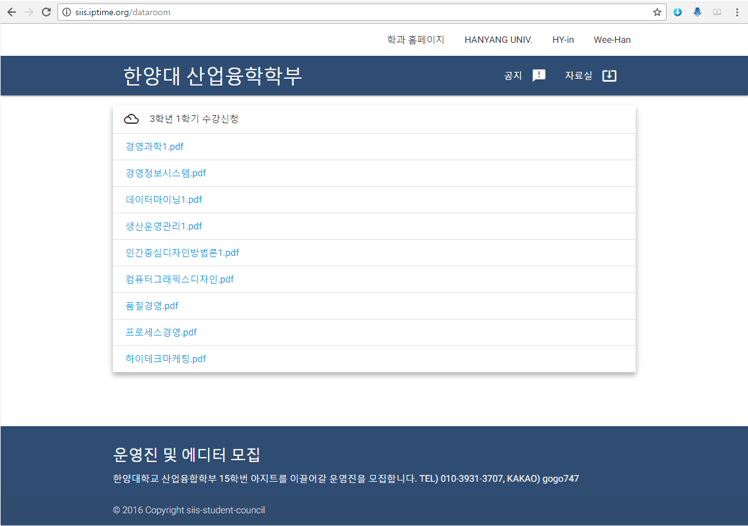
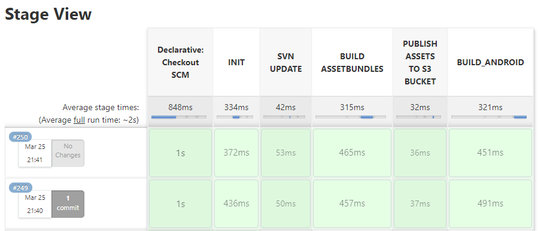
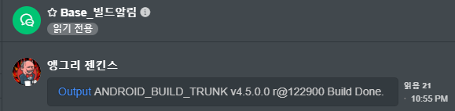
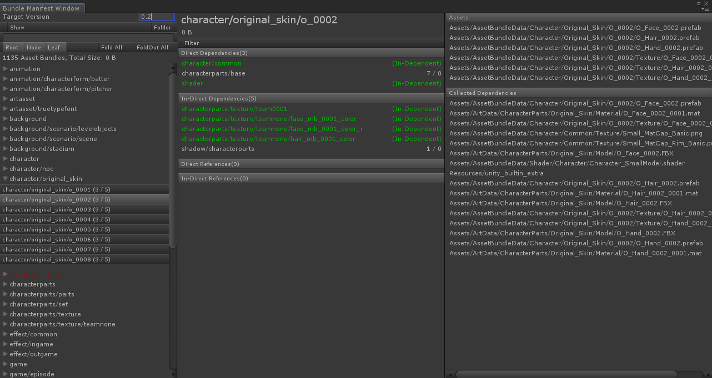
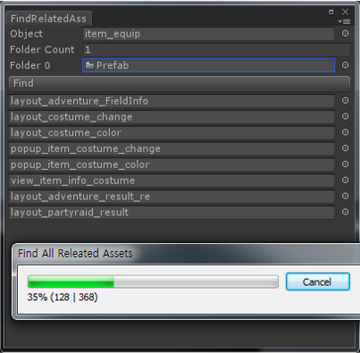

개발팀의 Yes Man, 백민우입니다.

# About Me
### Introduction
- 안녕하세요! 모바일 게임 클라이언트 개발자 백민우입니다.
- 원칙과 직관을 따르는 **열정적인 중재자**(INFP-T)입니다.
- 생산성 향상, 워크플로우에 대한 고민과 토론을 즐깁니다.

### Contact & Channel
- Email | usd122@naver.com
- Github | https://github.com/ez8801
- Linkedin | https://www.linkedin.com/in/minwoo-baek-b9476756

# Skills
### Game Client
- C#, C++
- Unity3d, UniRx
- WinForms

### DevOps
- Jenkins

### Native
- Java, Objective-C
- Android, iOS

### Collaboration
- Trello, Asana
- REDMINE, mantis
- JANDI, Telegram

### Version Control
- SVN

### Interests
- node.js(토이프로젝트 경험), Electron
- ProudNet(학습중)
- UniRx(학습중)

# Work Experience & Projects
### 게임빌 프로야구
- 각종 컨텐츠 구현
- Unity AssetBundle, Android Expansion File (*.obb) 등을 이용 패치 시스템 구현
- CD/CI (원격빌드, 빌드알림, 자동빌드)
- Unity3d 에디터 및 iOS/Android OS 업데이트 대응
- Android App Bundle (*.aab) 릴리즈 대응




### The King Of Fighters All Stars
- 성장 컨텐츠 제작
- Utils, Extension 제작

![] ()

### Knights of night
- 각종 컨텐츠 구현
- 밸런스 툴 제작
- 넷마블 메모리 보안 모듈 적용
- 로그 뷰어/패킷 모니터 제작




### GEOPIA
- Android/iOS API, Java/objective-c를 활용 어플리케이션 제작
- C2DM, APNS Notification구현
- 광고, 결제 및 써드파티 모듈 적용
- php, mysql를 활용 간단한 조회 페이지 구현
 
# Personal Experience & Projects
### 어플리케이션 제작 및 T store 배포


### 학생회 홈페이지 제작



node.js, EXPRESS, Jade 활용

# Education
### 한양대학교 응용시스템학과
- 3학년 과대표
### 한국 콘텐츠 진흥원 - 차세대 게임 과정
- 1년 교육 과정 수료
- 성적 우수 국비 장학생 선발 카네기멜론대학 ETC 센터 연수 (2개월)

# Certificate
### 정보처리 기능사
* 2011.03.07 취득

# Details
## Jenkins

평소 관심이 있었던 빌드 자동화. 
업무를 마친 후 남는 시간, 퇴근 후 시간을 할애하여 리서치와 시행착오를 반복한 끝에
문외한에서 빌드 담당자가 될 수 있었다.

### 빌드 개선 사례1

* 문제: 빌드 및 배포 과정이 하나로 구성되어 빌드의 현황과 이슈 발생 시 확인이 어려운 이슈
* 연구: groovy 스크립트, 파이프라인 학습
* 해결: 각 빌드 과정을 쪼개고, groovy 스크립트로 파이프라인을 구성
* 결과: 빌드 진행 현황을 파악하기 쉬워졌고, 이슈 발생 시 실패한 Node를 중점적으로 파악하여 이슈 확인이 용이해짐


### 빌드 개선 사례2

* 문제: 젠킨스 권한이 없는 인원은 여전히 빌드 현황을 파악할 수 없는 문제 + 빌드 난이도 문제
* 연구: [JANDI](https://www.jandi.com/landing/) 커넥트 기능과 Webhook, 젠킨스 원격빌드 연구
* 해결: [JANDI](https://www.jandi.com/landing/) 커넥트 기능과 Webhook, 젠킨스 원격빌드 적용
* 빌드 현황 [JANDI](https://www.jandi.com/landing/) 메시지 수신 및 젠킨스 원격빌드 연동
* 결과: 메신저로 빌드 진행상황을 수신, 빠르게 이슈에 대응 / 원격빌드 연동

```sh
curl
-X POST $JENKINS_WEB_HOOK_URL
-H "Accept: application/vnd.tosslab.jandi-v2+json"
-H "Content-Type: application/json"
--data-binary "{\"body\":\"$JOB_NAME v${APP_VERSION} r${REVISION} Build Started. \"}"
```



> Note: 젠킨스 원격 빌드을 이용하면 메신저에서 클릭 한번 만으로 후속조치(ex) 배포)를 할 수 있다. 
> 
> (깃털만큼의 귀찮음이라도 덜고 눈 깜박할 시간이라도 퇴근을 앞당기도록 하자.)

### obb 오류

* 문제: Apk파일과 obb파일의 unity.build-id가 맞지 않아 obb 파일이 인식되지 않는 현상
* 원인: AndroidManifest 설정을 유지하기 위해서 컴파일 후 엎어치는 과정에서 unity.build-id가 소실
* 해결: unity.build-id

Unity3d를 batchmode로 실행, 인자를 전달하여 옵션을 조절할 수 있다!

```sh
-quit -batchmode -projectPath "$WORKSPACE" -logFile "$WORKSPACE/log.log" -executeMethod ProjectBuilder.Build() -version $APP_VERSION -revision $REVISION -symbols $DEFINE_SYMBOLS
```

대부분의 설정은  유지 일부 설정은 

e.g) Android Extension File(*.obb)에 사용되는 unity.build-id 값

```cs
[UnityEditor.MenuItem("Build/Restore Unity Build Id")]
private static void RestoreUnityBuildId()
{
    string path = "AndroidManifest File Path";
    if (false == File.Exists(path))
        throw new FileNotFoundException("Android Manifest File");
        
    string idFilePath = "Id file Path";
    if (false == File.Exists(idFilePath))
        throw new FileNotFoundException("Id file Path");
        
    string unityBuildId = File.ReadAllText(idFilePath);
    XmlDocument doc = new XmlDocument();
    doc.Load(path);
    
    XmlNode manifestNode = doc.FindChildNode("manifest");
    XmlNode applicationNode = manifestNode.FindChildNode("application");
    
    string ns = applicationNode.GetNamespaceOfPrefix("android");
    
    // unity.build-id
    XmlElement element = applicationNode.FindElementWithAndroidName("meta-data", "name", ns, "unity.build-id");
    if (element == null)
    {
        element = doc.CreateElement("meta-data");
        element.SetAttribute("name", ns, "unity.build-id");
        element.SetAttribute("value", ns, unityBuildId);
        manifestNode.AppendChild(element);
    }
    else
    {
        string value = element.GetAttribute("value", ns);
        element.SetAttribute("value", ns, unityBuildId);
    }
    
    XmlWriterSettings settings = new XmlWriterSettings
    {
        Indent = true,
        IndentChars = "  ",
        NewLineChars = System.Environment.NewLine,
        NewLineHandling = NewLineHandling.Replace
    };
    
    using (XmlWriter xmlWriter = XmlWriter.Create(path, settings))
    {
        doc.Save(xmlWriter);
    }
}
```

### Shell

```bash
## Appguard
java -jar appguard-cli-builder.jar -h -i ${UNSIGNED_APK_NAME}

## Sign
jarsigner -verbose -tsa http://timestamp.comodoca.com/rfc3161 -sigalg SHA1withRSA -digestalg SHA1 -keystore ${KEYSTORE_NAME} ${APPGUARD_APK_NAME} ${ALIAS_NAME} -storepass ${STORE_PASS} -keypass ${KEY_PASS}

## Zip align
./zipalign -v 4 ${APPGUARD_APK_NAME} ${WORKSPACE}/OUTPUT/APK/${APK_NAME}

## Verify
cd ${WORKSPACE}/OUTPUT/APK
jarsigner -verify -verbose -certs ${APK_NAME}

## Archive
mkdir -p ${JENKINS_HOME}/jobs/$JOB_NAME/builds/${BUILD_NUMBER}/archive
cp ${APK_NAME} ${JENKINS_HOME}/jobs/$JOB_NAME/builds/${BUILD_NUMBER}/archive/${APK_NAME}
```

## 엑셀에서 바이너리 데이터로

특정 키로 추출된 다이제스트를 파일 끝에 붙여 파일 변조 여부를 판단

```cs
// Export
public void ExportBytes(string bytesFilePath)
{
    using (BinaryWriter bw = new BinaryWriter(new FileStream(bytesFilePath, FileMode.Create), Encoding.UTF8))
    {
        // Write Header
        // ...
        // Write Body Data
        // ...
        
        // Generate Key
        string key = Data.Crypto.GetRandomKey();
        byte[] keyBytes = Encoding.UTF8.GetBytes(key);

        // Write Key Size
        bw.Write((short)keyBytes.Length);

        // Write Key Bytes
        bw.Write(keyBytes);

        HMACMD5 oHMACMD5 = new HMACMD5(keyBytes);
        byte[] hashValue = oHMACMD5.ComputeHash(bytes);

        // Write Digest
        bw.Write(hashValue);
    }
}

...

// Load
public abstract class Table<T> : ITable where T : IDeserializable, new()
{
    ...
    public void Load(TextAsset textAsset)
    {
        if (textAsset == null)
            throw new System.ArgumentNullException("textAsset");

        Clear();
        Name = textAsset.name;

        Deserializer deserializer = new Deserializer();
        deserializer.ReadHeader(textAsset);
        EnsureCapacity(deserializer.RowCount);
        Deserialize(0, deserializer.RowCount, deserializer);
        deserializer.Validate();
        OnFinishedLoad();
    }
    ...
}

// Verity
private bool IsValid()
{
    byte[] keyBytes = null;
        
    //...
    // keyBytes = GetKeyBytes();
    //...

    HMACMD5 hmaCMD5 = new HMACMD5(keyBytes);

    //...

    byte[] computedHash = hmaCMD5.ComputeHash(data);
    if (IsMatch(ref computedHash, ref digest))
        return true;
}
```


## Bundle Manifest Window

번들간 관계, 포함하고 있는 어셋목록 등을 확인할 수 있는 에디터



## Dependency Tool

Asset(Material, Texture, Prefab ...)의 디펜던시 체크


