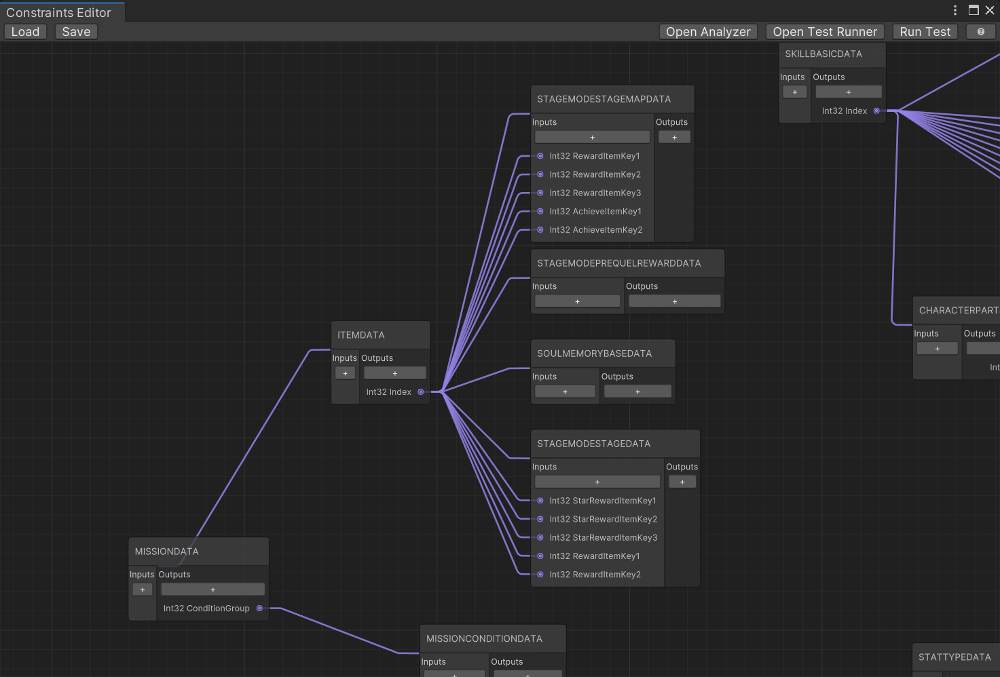
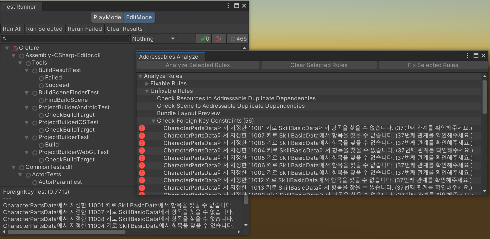
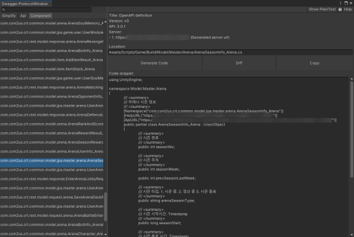

개발팀의 Yes Man, 백민우입니다.

# About Me
### Introduction
- 안녕하세요! 모바일 게임 클라이언트 개발자 백민우입니다.
- 원칙과 직관을 따르는 **열정적인 중재자**(INFP-T)입니다.
- 생산성 향상, 워크플로우에 대한 고민과 토론을 즐깁니다.

### Contact & Channel
- Email | usd122@naver.com
- Github | https://github.com/ez8801
- Linkedin | https://www.linkedin.com/in/minwoo-baek-b9476756
- Blog | https://blog.naver.com/usd122

# Skills
### Game Client
- C#, C++
- Unity3d, UniRx, UniTask
- WinForms

### DevOps
- Jenkins
- App Center

### Native
- Java, Objective-C
- Android, iOS

### Collaboration
- Trello, Asana, Jira
- REDMINE, mantis
- JANDI, Telegram, Naver works
- Confluence

### Version Control
- SVN, Github

### Engine
- Photon Quantum

### Third Party Plugin
- Bugsnag
- Firebase Analytics
- GPGS
- Apple Login
- Facebook

### Package
- ZString
- MemoryPack
- Newtonsoft.Json

### Interests
- node.js(토이프로젝트 경험), Electron, Flutter
- ProudNet(학습중)

# Projects
### 빌런즈 (2021. 7 ~ 2022. 7)
#### 각종 컨텐츠 구현
- 이모티콘
- AI 플레이어
- 친구, 팀 구성 등 커뮤니티 기능
- 인 게임 기획 내용, 피드백 및 편의성, 퍼포먼스 개선 작업

#### 시스템
- Addressable 시스템을 이용한 어셋 로드 및 패치 시스템 구현
- CI/CD 구축, 담당 (원격빌드, 빌드알림, 주기적빌드, 앱센터 연동)
- 기획 데이터 추출 툴 제작 (Enum, 배열 등 다양한 타입 지원 / 퀀텀 엔진 대응 / 소스 자동생성)
- 패킷 모니터 제작
- 퍼블리셔 SDK 적용 (애플/구글/페이스북 로그인, Bugsnag, Anlytics, Firebase 등)
- MessagePack 적용
- SuperSocket을 이용한 소켓 연동


### 게임빌 프로야구 (2017. 5 ~ 2021. 6)
#### 각종 컨텐츠 기능 구현 및 설계
- 선수육성 컨텐츠 및 고도화작업 (훈련, 트레이너 능력 등 각종 버프 반영, 시즌미션)
- 시나리오별 전용 컨텐츠 다수
- 선수육성 자동진행 작업
- 신규유저용 가이드 미션 (선수 육성 길잡이)
- 미션, 업적 기반 작업
- 슈퍼스타리그 아웃게임 부분 (비동기 PVP 랭킹 컨텐츠)
- 이벤트/공지 배너, 구단주 스케쥴 (컨텐츠 진행 현황), 로딩팁

#### 기타
- Unity AssetBundle, Android Expansion File (*.obb) 등을 이용 패치 시스템 구현
- CD/CI (원격빌드, 빌드알림, 자동빌드)
- Unity3d 에디터 및 iOS/Android OS 업데이트 대응
- Android App Bundle (*.aab) 릴리즈 대응
- 어셋 로드 최적화
- 서버 포팅/리팩토링 및 패킷 최적화 업무지원
- 패킷 암호화
- 소셜 플랫폼 연동 (Hive)


### The King Of Fighters All Stars (2016. 11 ~ 2017. 3)
- 성장 컨텐츠 제작 (캐릭터 일람/상세정보/편성/강화/진화/한계돌파/스킬 장착/능력치 산정 및 표시)
- 스킬 미리보기 기능 구현
- 컨텐츠, 스킬 해금
- Utils, Extension 제작


### Knights of night (2012. 7 ~ 2016. 11)
#### 컨텐츠 기능 구현 및 설계
- 아이템, 룬 강화/합성/진화/초월/재련/초월합성/변형
- 퀘스트/업적/미션/복귀자/빙고미션
- 능력치, 버프/디버프 시스템
- 대장간, 우편함
- 미니맵 구현, 몬스터 스킬/AI 패턴 추가
- 자동전투 기반작업

#### 기타
- 밸런스 툴 제작
- 넷마블 메모리 보안 모듈, 마블 팝 플러그인 적용
- 로그 뷰어/패킷 모니터 제작


### GEOPIA (2011. 2 ~ 2012. 7)
- Android/iOS API, Java/objective-c를 활용 어플리케이션 제작
- C2DM, APNS Notification구현
- 광고, 결제 및 써드파티 모듈 적용
- php, mysql를 활용 간단한 조회 페이지 구현

# Education
### 한양대학교 응용시스템학과 (졸업)
- 3학년 과대표
### 한국 콘텐츠 진흥원 - 차세대 게임 과정 (수료)
- 1년 교육 과정 수료
- 성적 우수 국비 장학생 선발 카네기멜론대학 ETC 센터 연수 (2개월)
### 울산대학교 기계자동차 공학부 (제적)
### 울산 애니원 고등학교 컴퓨터 게임개발 학과 (졸업)

# Certificate / License
### 정보처리 기능사
* 2011.03.07 취득

# Military Service
### 산업기능요원 복무
* 2011.03 ~ 14. 01 (GEOPIA > 넷마블 블루)

# Work Experience
## Jenkins

담당 업무는 아니었지만 평소 관심이 있었던 빌드 자동화. 
업무를 마치고 남는 시간, 퇴근 후 시간을 할애하여 리서치와 시행착오를 반복한 끝에
문외한에서 빌드 담당자가 됨.

### 빌드 개선 사례1

* 문제: 빌드 및 배포 과정이 하나로 구성되어 빌드의 현황과 이슈 발생 시 확인이 어려운 이슈
* 연구: groovy 스크립트, 파이프라인 학습
* 해결: 각 빌드 과정을 쪼개고, groovy 스크립트로 파이프라인을 구성
* 결과: 빌드 진행 현황을 파악하기 쉬워졌고, 이슈 발생 시 실패한 Node를 중점적으로 파악하여 이슈 확인이 용이해짐


### 빌드 개선 사례2

* 문제: 젠킨스 권한이 없는 인원은 여전히 빌드 현황을 파악할 수 없는 문제 + 빌드 난이도 문제
* 연구: [JANDI](https://www.jandi.com/landing/) 커넥트 기능과 Webhook, 젠킨스 원격빌드 연구
* 해결: [JANDI](https://www.jandi.com/landing/) 커넥트 기능과 Webhook, 젠킨스 원격빌드 적용
* 빌드 현황 [JANDI](https://www.jandi.com/landing/) 메시지 수신 및 젠킨스 원격빌드 연동
* 결과: 메신저로 빌드 진행상황을 수신, 빠르게 이슈에 대응 / 원격빌드 연동

```sh
curl
-X POST $JENKINS_WEB_HOOK_URL
-H "Accept: application/vnd.tosslab.jandi-v2+json"
-H "Content-Type: application/json"
--data-binary "{\"body\":\"$JOB_NAME v${APP_VERSION} r${REVISION} Build Started. \"}"
```


> Note: 젠킨스 원격 빌드을 이용하면 메신저에서 클릭 한번 만으로 후속조치(ex) 배포)를 할 수 있다. 
> 
> (깃털만큼의 귀찮음이라도 덜고 눈 깜박할 시간이라도 퇴근을 앞당기도록 하자.)

### obb 오류

* 문제: Apk파일과 obb파일의 unity.build-id가 맞지 않아 obb 파일이 인식되지 않는 현상
* 원인: AndroidManifest 설정을 유지하기 위해서 Android Project Export한 후 Manifest파일을 엎어치는 과정에서 unity.build-id가 소실
* 해결: Android Project Export > unity.build-id 백업 > AndroidManifest overwrite > unity.build-id 복원

```sh
-quit -batchmode -projectPath "$WORKSPACE" -logFile "$WORKSPACE/log.log" -executeMethod ProjectBuilder.Build() -version $APP_VERSION -revision $REVISION -symbols $DEFINE_SYMBOLS
```

> Unity3d를 batchmode로 실행하여서 특정 Method를 호출하는 식으로 작업

```cs
[UnityEditor.MenuItem("Build/Restore Unity Build Id")]
private static void RestoreUnityBuildId()
{
    string path = "AndroidManifest File Path";
    if (false == File.Exists(path))
        throw new FileNotFoundException("Android Manifest File");
        
    string idFilePath = "Id file Path";
    if (false == File.Exists(idFilePath))
        throw new FileNotFoundException("Id file Path");
        
    string unityBuildId = File.ReadAllText(idFilePath);
    XmlDocument doc = new XmlDocument();
    doc.Load(path);
    
    XmlNode manifestNode = doc.FindChildNode("manifest");
    XmlNode applicationNode = manifestNode.FindChildNode("application");
    
    string ns = applicationNode.GetNamespaceOfPrefix("android");
    
    // unity.build-id
    XmlElement element = applicationNode.FindElementWithAndroidName("meta-data", "name", ns, "unity.build-id");
    if (element == null)
    {
        element = doc.CreateElement("meta-data");
        element.SetAttribute("name", ns, "unity.build-id");
        element.SetAttribute("value", ns, unityBuildId);
        manifestNode.AppendChild(element);
    }
    else
    {
        string value = element.GetAttribute("value", ns);
        element.SetAttribute("value", ns, unityBuildId);
    }
    
    XmlWriterSettings settings = new XmlWriterSettings
    {
        Indent = true,
        IndentChars = "  ",
        NewLineChars = System.Environment.NewLine,
        NewLineHandling = NewLineHandling.Replace
    };
    
    using (XmlWriter xmlWriter = XmlWriter.Create(path, settings))
    {
        doc.Save(xmlWriter);
    }
}
```

### 릴리즈 이슈

* 문제: Android Studio에서 빌드하던 것에서 다양한 요구사항 반영 필요 
* 해결: Command line tool을 이용 빌드 시스템 커스텀화
* 결과: 앱 서명, 난독화 솔루션 적용, zipalign, Android App Bundle (*.aab) 등 다양한 릴리즈 상황 대응

```bash
## Appguard
java -jar appguard-cli-builder.jar -h -i ${UNSIGNED_APK_NAME}

## Sign
jarsigner -verbose -tsa http://timestamp.comodoca.com/rfc3161 -sigalg SHA1withRSA -digestalg SHA1 -keystore ${KEYSTORE_NAME} ${APPGUARD_APK_NAME} ${ALIAS_NAME} -storepass ${STORE_PASS} -keypass ${KEY_PASS}

## Zip align
./zipalign -v 4 ${APPGUARD_APK_NAME} ${WORKSPACE}/OUTPUT/APK/${APK_NAME}

## Verify
cd ${WORKSPACE}/OUTPUT/APK
jarsigner -verify -verbose -certs ${APK_NAME}

## Archive
mkdir -p ${JENKINS_HOME}/jobs/$JOB_NAME/builds/${BUILD_NUMBER}/archive
cp ${APK_NAME} ${JENKINS_HOME}/jobs/$JOB_NAME/builds/${BUILD_NUMBER}/archive/${APK_NAME}
```

### 앱내 포함되는 데이터 혹은 DLC 보안 이슈

* 문제: 빌드 혹은 패치파일 내 파일들의 보안 이슈
* 해결: 특정 키로 추출된 다이제스트를 파일 끝에 붙여, 파일 로드 시에 계산된 Hash값과 첨부된 다이제스트를 비교 파일 변조 여부를 판단

```cs
// Export
public void ExportBytes(string bytesFilePath)
{
    using (BinaryWriter bw = new BinaryWriter(new FileStream(bytesFilePath, FileMode.Create), Encoding.UTF8))
    {
        // Write Header
        // ...
        // Write Body Data
        // ...
        
        // Generate Key
        string key = Data.Crypto.GetRandomKey();
        byte[] keyBytes = Encoding.UTF8.GetBytes(key);

        // Write Key Size
        bw.Write((short)keyBytes.Length);

        // Write Key Bytes
        bw.Write(keyBytes);

        HMACMD5 oHMACMD5 = new HMACMD5(keyBytes);
        byte[] hashValue = oHMACMD5.ComputeHash(bytes);

        // Write Digest
        bw.Write(hashValue);
    }
}

...

// Load
public abstract class Table<T> : ITable where T : IDeserializable, new()
{
    ...
    public void Load(TextAsset textAsset)
    {
        if (textAsset == null)
            throw new System.ArgumentNullException("textAsset");

        Clear();
        Name = textAsset.name;

        Deserializer deserializer = new Deserializer();
        deserializer.ReadHeader(textAsset);
        EnsureCapacity(deserializer.RowCount);
        Deserialize(0, deserializer.RowCount, deserializer);
        deserializer.Validate();
        OnFinishedLoad();
    }
    ...
}

// Verity
private bool IsValid()
{
    byte[] keyBytes = null;
        
    //...
    // keyBytes = GetKeyBytes();
    //...

    HMACMD5 hmaCMD5 = new HMACMD5(keyBytes);

    //...

    byte[] computedHash = hmaCMD5.ComputeHash(data);
    if (IsMatch(ref computedHash, ref digest))
        return true;
}
```


### 어셋번들 종속성 이슈

* 문제: 어셋번들간 얽힌 종속성으로 인해 어셋번들 로드 시, 종속성을 가진 어셋번들을 다수 로드해야 하는 현상 + 관리 측면 이슈
* 연구: 어셋번들 압축 방식 연구, 관리 측면에 대한 고민
* 결과: 어셋번들에서 어셋을 로드할 때, 일부 Chunk만 읽어와 사용할 수 있는 LZ4(청크 기반 압축) 방식 적용, 어셋 번들 관리에 필요한 에디터 다수 제작

번들간 관계, 포함하고 있는 어셋목록 등을 확인할 수 있는 에디터


Asset(Material, Texture, Prefab ...)의 디펜던시 체크


## 툴 제작
### 데이터 툴 및 바이너리 파일 포맷 제작
엑셀 형태의 기획/테이블 데이터를 제작한 바이너리 포맷으로 변환해주는 툴 제작

- 엑셀 데이터를 바이너리 데이터로 변환
- 데이터 오브젝트 클래스와 Deserialize 코드를 자동생성
- ScriptableObject, Enum 등 지원
- 데이터 변조방지


### 패킷 모니터
서버/클라이언트 파트뿐 아니라 에디터 환경에서의 버그나 이슈와 같은 특정 상황에서의 패킷 Request/Response 값을 간편하게 복사하고 
의사소통할 수 있는 툴 제작


### 테이블 검증기

테이블 데이터의 관계를 설정, 해당 데이터를 Test와 Addressable Analyze Rule로 검증




### 스웨거 API 문서 뷰어 및 코드 생성

패킷과 모델을 확인할 수 있고, 코드 생성



## 문서화
각종 가이드, 이슈 대응방법 및 히스토리 관리를 용이하게 하기 위한 꾸준한 문서 작성


# Personal Experience & Projects
### 어플리케이션 제작 및 T store 배포


### 학생회 홈페이지 제작


node.js, EXPRESS, Jade 활용

### Socket.io를 이용하여 Unity3d와 채팅 연동
