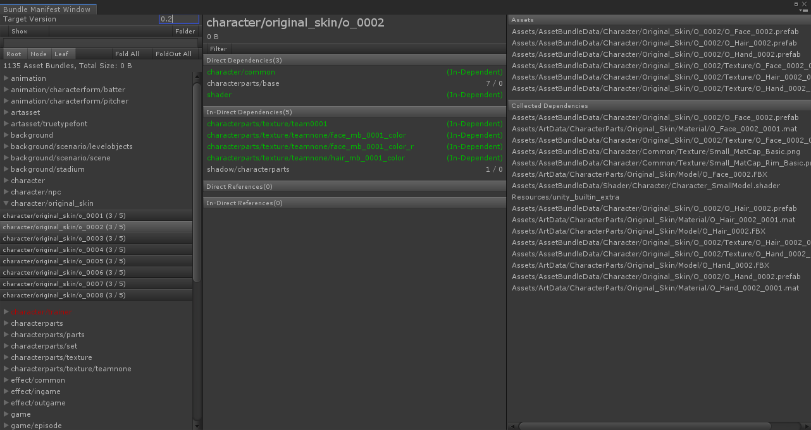

Minwoo Baek

# About Me
### Introduction
- Hi! I'm Minwoo Baek, 

### Contact & Channel
- Email | usd122@naver.com
- Github | https://github.com/ez8801
- Linkedin | https://www.linkedin.com/in/minwoo-baek-b9476756

# Skills
### Game Client
- C#, C++
- Unity3d, UniRx
- WinForms

### DevOps
- Jenkins

### Native
- Java, Objective-C
- Android, iOS

### Collaboration
- Trello, Asana
- REDMINE, mantis
- JANDI, Telegram

### Version Control
- SVN

### Interests
- node.js(Toy Project), Electron
- ProudNet(Prototyping)
- UniRx(Prototyping)

# Projects
### Gamevil Baseball super stars (2017. 5 ~ 2021. 3)
#### Implemented new features
- Auto Play
- Mission/Achievement/Guide
- Event Banner, Loading tip

#### ETC
- Designed and implemented a DLC system using Unity AssetBundle, Android Expansion File (*.obb)
- CD/CI (Remote Build, Notification, Daily Build)
- Applied new Unity3d/Android/iOS version
- Support Android App Bundle (*.aab)
- Optimize Asset Loading
- Assisted server refactoring and packet optimization
- Packet Encryption
- Applied a Social Platform (In-house module, called hive)


### The King Of Fighters All Stars (2016. 11 ~ 2017. 3)
- Implemented new features
- Level Contents (Characters, Skills, Stats)
- Developed Utils, Extension


### Knights of night (2012. 7 ~ 2016. 11)
#### Implemented new features
- Item, Rune System
- Quest/Achiement/Mission System
- Stats, Buff/Debuff System
- Monster Skill/AI
- Automatic play

#### ETC
- Applied in-house modules (Memory security, Ranking)
- Developed Log Viewer, Packet Monitor


### GEOPIA (2011. 2 ~ 2012. 7)
- Developed Mobile Application using Android/iOS API, Java/objective-c
- Implemented Notification using C2DM, APNS
- Applied third party modules such as ad, payment.
- Developed API using php, mysql

# Education
### Hanyang Univ, Applied System (졸업)
- 3학년 과대표
### Korea Creative Content Agency - Program (수료)
- 1년 교육 과정 수료
- 성적 우수 국비 장학생 선발 카네기멜론대학 ETC 센터 연수 (2개월)
### Ulsan Univ, Mechanical and Automotive Engineering (제적)
### Ulsan Anione High School, Department of Computer Games (졸업)
- C, WinAPI, DirectX, 3d Max

# Certificate / License
### 정보처리 기능사
* 2011.03.07 취득

# Military Service
### Serving as Skilled Industrial Personnel
* 2011.03 ~ 14. 01 (GEOPIA > Netmarble Blue)

# Work Experience
## Jenkins

담당 업무는 아니었지만 평소 관심이 있었던 빌드 자동화. 
업무를 마치고 남는 시간, 퇴근 후 시간을 할애하여 리서치와 시행착오를 반복한 끝에
문외한에서 빌드 담당자가 됨.

### Build improvement case 1

* Problem: 빌드 및 배포 과정이 하나로 구성되어 빌드의 현황과 이슈 발생 시 확인이 어려운 이슈
* Research: groovy script and pipeline study
* Solution: Configure pipeline using groovy script
* Result: 빌드 진행 현황을 파악하기 쉬워졌고, 이슈 발생 시 실패한 Node를 중점적으로 파악하여 이슈 확인이 용이해짐


### Build improvement case 2

* Problem: 젠킨스 권한이 없는 인원은 여전히 빌드 현황을 파악할 수 없는 문제 + 빌드 난이도 문제
* Research: [JANDI](https://www.jandi.com/landing/) 커넥트 기능과 Webhook, 젠킨스 원격빌드 연구
* Solution: [JANDI](https://www.jandi.com/landing/) 커넥트 기능과 Webhook, 젠킨스 원격빌드 적용
* 빌드 현황 [JANDI](https://www.jandi.com/landing/) 메시지 수신 및 젠킨스 원격빌드 연동
* Result: 메신저로 빌드 진행상황을 수신, 빠르게 이슈에 대응 / 원격빌드 연동

```sh
curl
-X POST $JENKINS_WEB_HOOK_URL
-H "Accept: application/vnd.tosslab.jandi-v2+json"
-H "Content-Type: application/json"
--data-binary "{\"body\":\"$JOB_NAME v${APP_VERSION} r${REVISION} Build Started. \"}"
```


> Note: 젠킨스 원격 빌드을 이용하면 메신저에서 클릭 한번 만으로 후속조치(ex) 배포)를 할 수 있다. 
> 
> (깃털만큼의 귀찮음이라도 덜고 눈 깜박할 시간이라도 퇴근을 앞당기도록 하자.)

### obb error

* Problem: Apk파일과 obb파일의 unity.build-id가 맞지 않아 obb 파일이 인식되지 않는 현상
* Cause: AndroidManifest 설정을 유지하기 위해서 Android Project Export한 후 Manifest파일을 엎어치는 과정에서 unity.build-id가 소실
* Solution: Android Project Export > unity.build-id 백업 > AndroidManifest overwrite > unity.build-id 복원

```sh
-quit -batchmode -projectPath "$WORKSPACE" -logFile "$WORKSPACE/log.log" -executeMethod ProjectBuilder.Build() -version $APP_VERSION -revision $REVISION -symbols $DEFINE_SYMBOLS
```

> Unity3d를 batchmode로 실행하여서 특정 Method를 호출하는 식으로 작업

```cs
[UnityEditor.MenuItem("Build/Restore Unity Build Id")]
private static void RestoreUnityBuildId()
{
    string path = "AndroidManifest File Path";
    if (false == File.Exists(path))
        throw new FileNotFoundException("Android Manifest File");
        
    string idFilePath = "Id file Path";
    if (false == File.Exists(idFilePath))
        throw new FileNotFoundException("Id file Path");
        
    string unityBuildId = File.ReadAllText(idFilePath);
    XmlDocument doc = new XmlDocument();
    doc.Load(path);
    
    XmlNode manifestNode = doc.FindChildNode("manifest");
    XmlNode applicationNode = manifestNode.FindChildNode("application");
    
    string ns = applicationNode.GetNamespaceOfPrefix("android");
    
    // unity.build-id
    XmlElement element = applicationNode.FindElementWithAndroidName("meta-data", "name", ns, "unity.build-id");
    if (element == null)
    {
        element = doc.CreateElement("meta-data");
        element.SetAttribute("name", ns, "unity.build-id");
        element.SetAttribute("value", ns, unityBuildId);
        manifestNode.AppendChild(element);
    }
    else
    {
        string value = element.GetAttribute("value", ns);
        element.SetAttribute("value", ns, unityBuildId);
    }
    
    XmlWriterSettings settings = new XmlWriterSettings
    {
        Indent = true,
        IndentChars = "  ",
        NewLineChars = System.Environment.NewLine,
        NewLineHandling = NewLineHandling.Replace
    };
    
    using (XmlWriter xmlWriter = XmlWriter.Create(path, settings))
    {
        doc.Save(xmlWriter);
    }
}
```

### 릴리즈 이슈

* Problem: Android Studio에서 빌드하던 것에서 다양한 요구사항 반영 필요 
* Solution: Customize Build system using command line tools
* Result: Sign App, Apply Obfuscation Solution, zipalign, Support Android App Bundle (*.aab)

```bash
## Appguard
java -jar appguard-cli-builder.jar -h -i ${UNSIGNED_APK_NAME}

## Sign
jarsigner -verbose -tsa http://timestamp.comodoca.com/rfc3161 -sigalg SHA1withRSA -digestalg SHA1 -keystore ${KEYSTORE_NAME} ${APPGUARD_APK_NAME} ${ALIAS_NAME} -storepass ${STORE_PASS} -keypass ${KEY_PASS}

## Zip align
./zipalign -v 4 ${APPGUARD_APK_NAME} ${WORKSPACE}/OUTPUT/APK/${APK_NAME}

## Verify
cd ${WORKSPACE}/OUTPUT/APK
jarsigner -verify -verbose -certs ${APK_NAME}

## Archive
mkdir -p ${JENKINS_HOME}/jobs/$JOB_NAME/builds/${BUILD_NUMBER}/archive
cp ${APK_NAME} ${JENKINS_HOME}/jobs/$JOB_NAME/builds/${BUILD_NUMBER}/archive/${APK_NAME}
```

### 앱내 포함되는 데이터 혹은 DLC 보안 이슈

* Problem: 빌드 혹은 패치파일 내 파일들의 보안 이슈
* Solution: 특정 키로 추출된 다이제스트를 파일 끝에 붙여, 파일 로드 시에 계산된 Hash값과 첨부된 다이제스트를 비교 파일 변조 여부를 판단

```cs
// Export
public void ExportBytes(string bytesFilePath)
{
    using (BinaryWriter bw = new BinaryWriter(new FileStream(bytesFilePath, FileMode.Create), Encoding.UTF8))
    {
        // Write Header
        // ...
        // Write Body Data
        // ...
        
        // Generate Key
        string key = Data.Crypto.GetRandomKey();
        byte[] keyBytes = Encoding.UTF8.GetBytes(key);

        // Write Key Size
        bw.Write((short)keyBytes.Length);

        // Write Key Bytes
        bw.Write(keyBytes);

        HMACMD5 oHMACMD5 = new HMACMD5(keyBytes);
        byte[] hashValue = oHMACMD5.ComputeHash(bytes);

        // Write Digest
        bw.Write(hashValue);
    }
}

...

// Load
public abstract class Table<T> : ITable where T : IDeserializable, new()
{
    ...
    public void Load(TextAsset textAsset)
    {
        if (textAsset == null)
            throw new System.ArgumentNullException("textAsset");

        Clear();
        Name = textAsset.name;

        Deserializer deserializer = new Deserializer();
        deserializer.ReadHeader(textAsset);
        EnsureCapacity(deserializer.RowCount);
        Deserialize(0, deserializer.RowCount, deserializer);
        deserializer.Validate();
        OnFinishedLoad();
    }
    ...
}

// Verity
private bool IsValid()
{
    byte[] keyBytes = null;
        
    //...
    // keyBytes = GetKeyBytes();
    //...

    HMACMD5 hmaCMD5 = new HMACMD5(keyBytes);

    //...

    byte[] computedHash = hmaCMD5.ComputeHash(data);
    if (IsMatch(ref computedHash, ref digest))
        return true;
}
```


### Asset Bundle Dependency Issue

* Problem: 어셋번들간 얽힌 종속성으로 인해 어셋번들 로드 시, 종속성을 가진 어셋번들을 다수 로드해야 하는 현상 + 관리 측면 이슈
* Research: 어셋번들 압축 방식 연구, 관리 측면에 대한 고민
* Result: 어셋번들에서 어셋을 로드할 때, 일부 Chunk만 읽어와 사용할 수 있는 LZ4(청크 기반 압축) 방식 적용, 어셋 번들 관리에 필요한 에디터 다수 제작

번들간 관계, 포함하고 있는 어셋목록 등을 확인할 수 있는 에디터



Check Asset(Material, Texture, Prefab ...)'s Dependency


# Personal Experience & Projects
### Develop application and publish to store


### Develop Student council website


node.js, EXPRESS, Jade

### Develop Chat system using Socket.io
