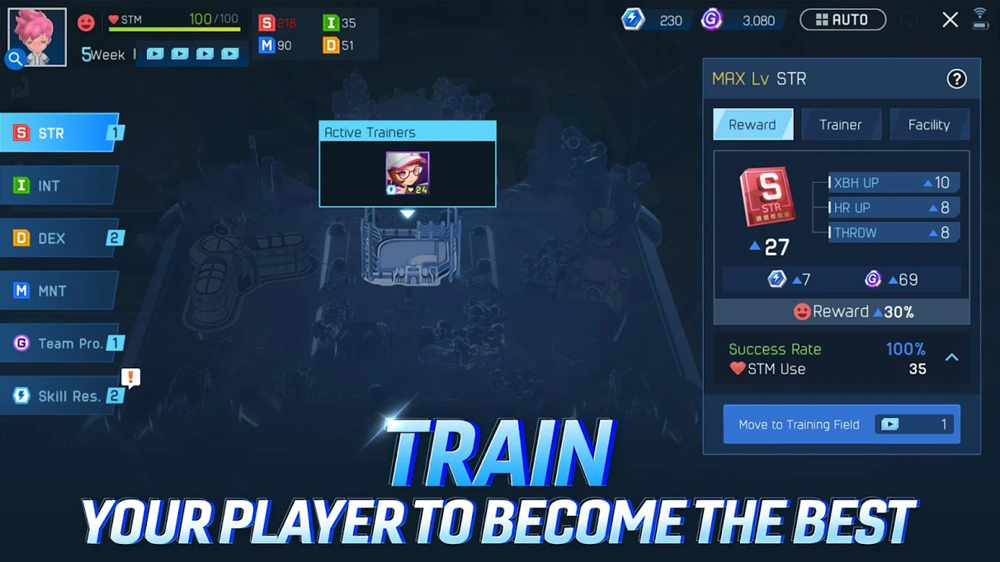
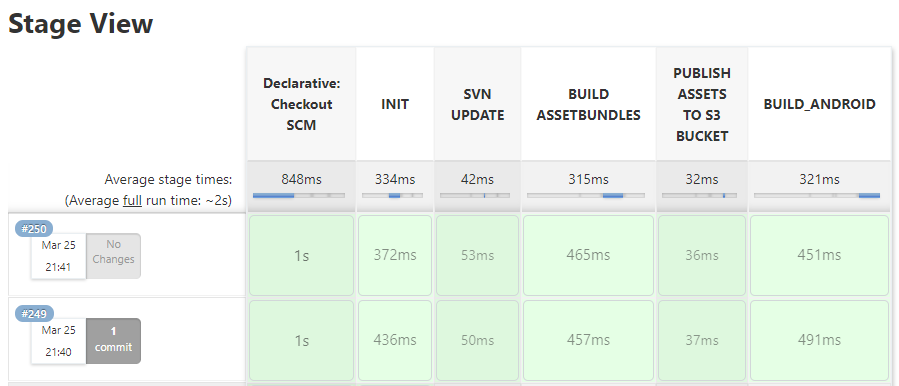
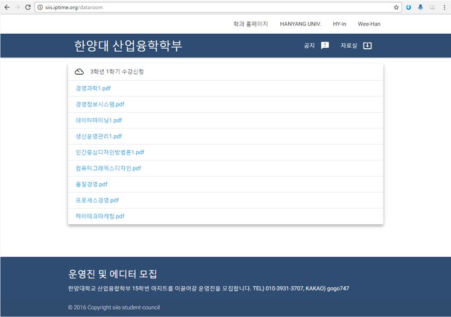

Minwoo Baek

# About Me
### Introduction
- Hi! I'm Minwoo Baek, I work as a Unity3d developer at a game developer.
- I'm interested in productivity improvement, workflow, and enjoy discussions.

### Contact & Channel
- Email | usd122@naver.com
- Github | https://github.com/ez8801
- Linkedin | https://www.linkedin.com/in/minwoo-baek-b9476756

# Skills
### Game Client
- C#, C++
- Unity3d, UniRx
- WinForms

### DevOps
- Jenkins

### Native
- Java, Objective-C
- Android, iOS

### Collaboration
- Trello, Asana
- REDMINE, mantis
- JANDI, Telegram

### Version Control
- SVN

### Interests
- node.js(Toy Project), Electron
- ProudNet(Prototyping)
- UniRx(Prototyping)

# Projects
### Gamevil Baseball super stars (2017. 5 ~ 2021. 3)
- Implemented new features. Such as Mission, Auto Play, Event Banner, Loading tip and various contents
- Designed and implemented a DLC system using Unity AssetBundle, Android Expansion File (*.obb)
- CD/CI (Remote Build, Notification, Daily Build)
- Applied new Unity3d/Android/iOS version
- Support Android App Bundle (*.aab)
- Optimize Asset Loading
- Assisted server refactoring and packet optimization
- Packet Encryption
- Applied a Social Platform (In-house module, called hive)




### The King Of Fighters All Stars (2016. 11 ~ 2017. 3)
- Implemented new features about level contents (Characters, Skills, Stats)
- Developed Utils, Extension


### Knights of night (2012. 7 ~ 2016. 11)
- Implemented new features about level contents and outgame (Item System, Quest System, Stats/Buff/Debuff System, Automatic Play)
- Applied in-house modules (Memory security, Ranking)
- Developed WebClient
- Developed Log Viewer, Packet Monitor


### GEOPIA (2011. 2 ~ 2012. 7)
- Developed Mobile Application using Android/iOS API, Java/objective-c
- Implemented Notification using C2DM, APNS
- Applied third party modules such as ad, payment.
- Developed API using php, mysql

# Education
### Hanyang Univ, Applied System (Graduated)
- The Departmental student representative
### Korea Creative Content Agency - Program (Completed)
### Ulsan Univ, Mechanical and Automotive Engineering
### Ulsan Anione High School, Department of Computer Games (Graduated)
- C, WinAPI, DirectX, 3d Max

# Certificate / License
### Craftsman Information Processing
* 2011.03.07

# Military Service
### Serving as Skilled Industrial Personnel
* 2011.03 ~ 14. 01 (GEOPIA > Netmarble Blue)

# Work Experience
## Jenkins
### Build improvement case 1

* Problem: The build and distribution integrated and configured as one step. Difficulty checking the current status and errors of the building.
* Research: groovy script and pipeline study
* Solution: Configure pipeline using groovy script
* Result: It's easier to understand the progress of the build, When an issue occurs, focus on identifying the failed node.


### Build improvement case 2

* Problem: The veiled build status
* Research: [JANDI](https://www.jandi.com/landing/) Connect functions and webhook, jenkins remote build study
* Solution: [JANDI](https://www.jandi.com/landing/) Connect functions and webhook, jenkins remote build apply
* Result: Implemented Messenger Notifications and remote build. 

```sh
curl
-X POST $JENKINS_WEB_HOOK_URL
-H "Accept: application/vnd.tosslab.jandi-v2+json"
-H "Content-Type: application/json"
--data-binary "{\"body\":\"$JOB_NAME v${APP_VERSION} r${REVISION} Build Started. \"}"
```


> Note: It's possible to run remote build just one click. (ex) distribution)

### obb error

* Problem: a Mismatch between APK's build-id and OBB file's build-id. obb system does not work.
* Cause: Build-id is lost in the process of overwriting the Manifest file after Android Project export.
* Solution: Android Project export > unity.build-id back up > AndroidManifest overwrite > unity.build-id restore

```sh
-quit -batchmode -projectPath "$WORKSPACE" -logFile "$WORKSPACE/log.log" -executeMethod ProjectBuilder.Build() -version $APP_VERSION -revision $REVISION -symbols $DEFINE_SYMBOLS
```

> Run Unity3d in batch mode to call a specific method.

```cs
[UnityEditor.MenuItem("Build/Restore Unity Build Id")]
private static void RestoreUnityBuildId()
{
    string path = "AndroidManifest File Path";
    if (false == File.Exists(path))
        throw new FileNotFoundException("Android Manifest File");
        
    string idFilePath = "Id file Path";
    if (false == File.Exists(idFilePath))
        throw new FileNotFoundException("Id file Path");
        
    string unityBuildId = File.ReadAllText(idFilePath);
    XmlDocument doc = new XmlDocument();
    doc.Load(path);
    
    XmlNode manifestNode = doc.FindChildNode("manifest");
    XmlNode applicationNode = manifestNode.FindChildNode("application");
    
    string ns = applicationNode.GetNamespaceOfPrefix("android");
    
    // unity.build-id
    XmlElement element = applicationNode.FindElementWithAndroidName("meta-data", "name", ns, "unity.build-id");
    if (element == null)
    {
        element = doc.CreateElement("meta-data");
        element.SetAttribute("name", ns, "unity.build-id");
        element.SetAttribute("value", ns, unityBuildId);
        manifestNode.AppendChild(element);
    }
    else
    {
        string value = element.GetAttribute("value", ns);
        element.SetAttribute("value", ns, unityBuildId);
    }
    
    XmlWriterSettings settings = new XmlWriterSettings
    {
        Indent = true,
        IndentChars = "  ",
        NewLineChars = System.Environment.NewLine,
        NewLineHandling = NewLineHandling.Replace
    };
    
    using (XmlWriter xmlWriter = XmlWriter.Create(path, settings))
    {
        doc.Save(xmlWriter);
    }
}
```

### Various build specs

* Problem: Cannot handle various build specifications.
* Solution: Customize Build system using command line tools
* Result: Sign App, Apply Obfuscation Solution, zipalign, Support Android App Bundle (*.aab)

```bash
## Appguard
java -jar appguard-cli-builder.jar -h -i ${UNSIGNED_APK_NAME}

## Sign
jarsigner -verbose -tsa http://timestamp.comodoca.com/rfc3161 -sigalg SHA1withRSA -digestalg SHA1 -keystore ${KEYSTORE_NAME} ${APPGUARD_APK_NAME} ${ALIAS_NAME} -storepass ${STORE_PASS} -keypass ${KEY_PASS}

## Zip align
./zipalign -v 4 ${APPGUARD_APK_NAME} ${WORKSPACE}/OUTPUT/APK/${APK_NAME}

## Verify
cd ${WORKSPACE}/OUTPUT/APK
jarsigner -verify -verbose -certs ${APK_NAME}

## Archive
mkdir -p ${JENKINS_HOME}/jobs/$JOB_NAME/builds/${BUILD_NUMBER}/archive
cp ${APK_NAME} ${JENKINS_HOME}/jobs/$JOB_NAME/builds/${BUILD_NUMBER}/archive/${APK_NAME}
```

### DLC Security Issue

* Problem: DLC Security Issue
* Solution: Attach the digest extracted with a specific key to the end of the file. If the Hash value is invalid when loading the file, it throw an error.

```cs
// Export
public void ExportBytes(string bytesFilePath)
{
    using (BinaryWriter bw = new BinaryWriter(new FileStream(bytesFilePath, FileMode.Create), Encoding.UTF8))
    {
        // Write Header
        // ...
        // Write Body Data
        // ...
        
        // Generate Key
        string key = Data.Crypto.GetRandomKey();
        byte[] keyBytes = Encoding.UTF8.GetBytes(key);

        // Write Key Size
        bw.Write((short)keyBytes.Length);

        // Write Key Bytes
        bw.Write(keyBytes);

        HMACMD5 oHMACMD5 = new HMACMD5(keyBytes);
        byte[] hashValue = oHMACMD5.ComputeHash(bytes);

        // Write Digest
        bw.Write(hashValue);
    }
}

...

// Load
public abstract class Table<T> : ITable where T : IDeserializable, new()
{
    ...
    public void Load(TextAsset textAsset)
    {
        if (textAsset == null)
            throw new System.ArgumentNullException("textAsset");

        Clear();
        Name = textAsset.name;

        Deserializer deserializer = new Deserializer();
        deserializer.ReadHeader(textAsset);
        EnsureCapacity(deserializer.RowCount);
        Deserialize(0, deserializer.RowCount, deserializer);
        deserializer.Validate();
        OnFinishedLoad();
    }
    ...
}

// Verity
private bool IsValid()
{
    byte[] keyBytes = null;
        
    //...
    // keyBytes = GetKeyBytes();
    //...

    HMACMD5 hmaCMD5 = new HMACMD5(keyBytes);

    //...

    byte[] computedHash = hmaCMD5.ComputeHash(data);
    if (IsMatch(ref computedHash, ref digest))
        return true;
}
```


### Asset Bundle Dependency Issue

* Problem: The Spaghetti Asset Bundles
* Research: Research AssetBundle Compression and manage side
* Result: Applied LZ4(Chunk based compression) Compression, Developed AssetBundle Managing Custom Editors

The editor what can check the dependency between bundles


Check Asset(Material, Texture, Prefab ...)'s Dependency


# Personal Experience & Projects
### Develop application and publish to store


### Develop Student council website



node.js, EXPRESS, Jade

### Develop Chat system using Socket.io
